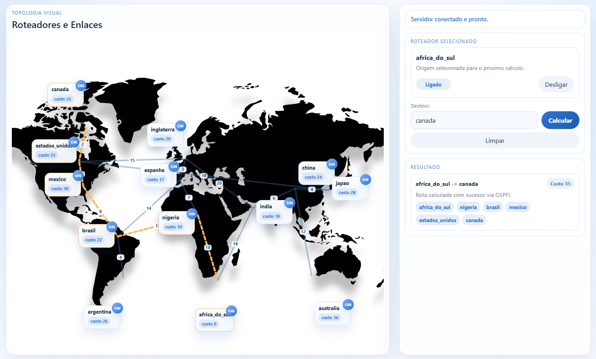
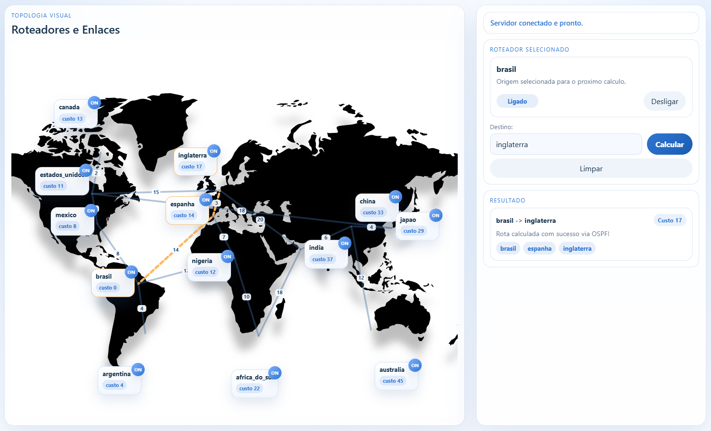

# Algoritmo de Dijkstra no Protocolo Open Shortest Path First (OSPF)

- Número da Lista: 8
- Conteúdo da Disciplina: Grafos 1

LINK DO VÍDEO DE APRESENTAÇÃO: https://youtu.be/RPd642XMryg

## Alunos
| Matricula | Aluno |
| -- | -- |
| 221022490 | Caua Araujo dos Santos |
| 222014859 | Ian Costa Guimaraes |

## Sobre
Este projeto consiste em uma simulação visual de roteamento em rede, construída para demonstrar, de forma prática e interativa, como um algoritmo de caminho mínimo pode ser aplicado sobre um grafo que representa conexões entre países/roteadores distribuídos em um mapa mundial. A ideia central é que cada país exibido no mapa funcione como um nó da rede, enquanto as ligações entre eles representam enlaces com determinados custos. A partir disso, o sistema permite que o usuário escolha uma origem e um destino e solicite o cálculo da melhor rota possível entre esses dois pontos, evidenciando o funcionamento do algoritmo em tempo de execução.

## Screenshots
### África do Sul -> Canadá


### Brasil -> Inglaterra


### Índia -> Argentina


## Instalação
### Pre-requisitos
- Windows ou Linux com `gcc` disponível no terminal.
- Python 3.

### Como rodar o projeto
No PowerShell, dentro da pasta do projeto:

```bash
cd C:\diretório-do-projeto
```
```bash
gcc dijkstra.c heap.c -o roteador_ospf
```
```bash
python servidor.py
```

Com o servidor em execucao, abra no navegador:

```text
http://127.0.0.1:8080/index.html
```

## Uso
1. Clique em um roteador no mapa para defini-lo como origem.
2. Digite o `id` (nome do roteador) do destino no campo lateral e clique em `Calcular`.
3. Resultado observável na seção onde conta com os roteadores visitados e o custo total.
